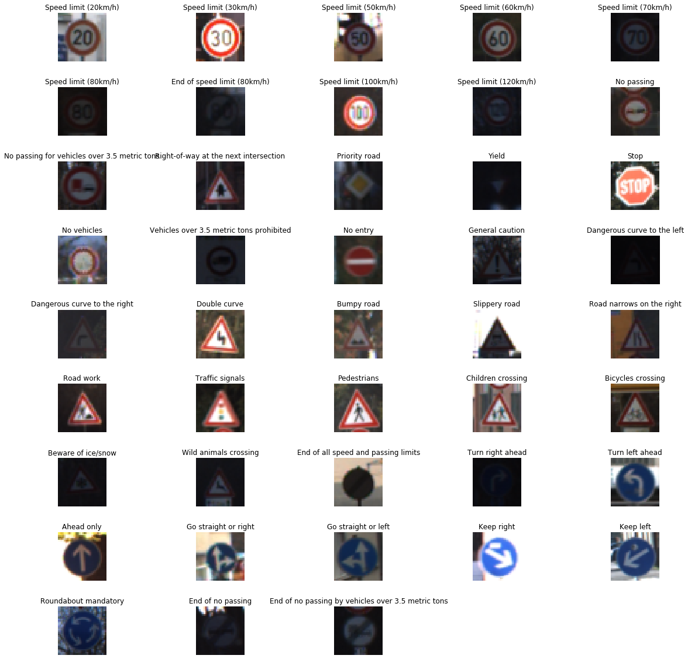
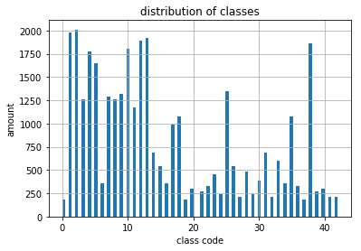
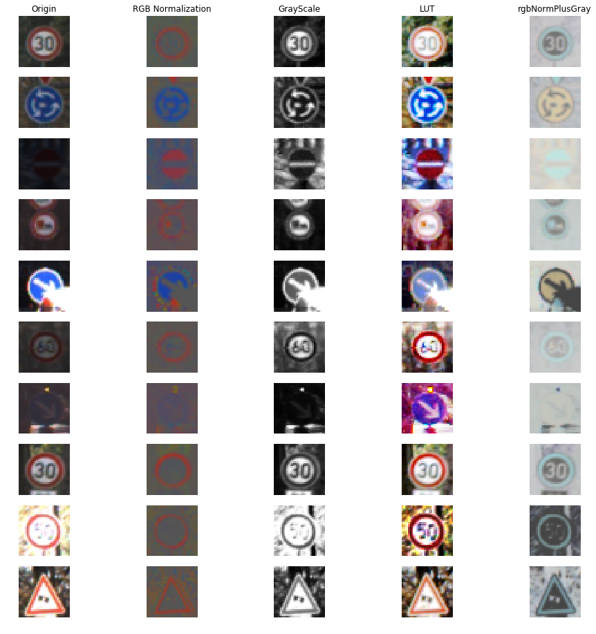
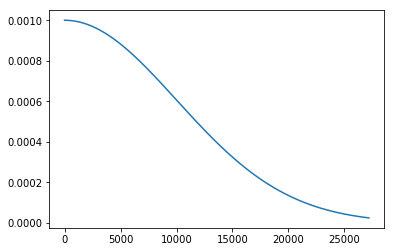
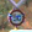
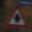
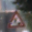
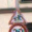

#**Traffic Sign Recognition**

---

**Build a Traffic Sign Recognition Project**

The goals / steps of this project are the following:
* Load the data set (see below for links to the project data set)
* Explore, summarize and visualize the data set
* Design, train and test a model architecture
* Use the model to make predictions on new images
* Analyze the softmax probabilities of the new images
* Summarize the results with a written report

[//]: # (Image References)

[image1]: ./43classes.png "Visualization"
[image2]: ./examples/grayscale.jpg "Grayscaling"
[image3]: ./examples/random_noise.jpg "Random Noise"
[image4]: ./examples/placeholder.png "Traffic Sign 1"
[image5]: ./examples/placeholder.png "Traffic Sign 2"
[image6]: ./examples/placeholder.png "Traffic Sign 3"
[image7]: ./examples/placeholder.png "Traffic Sign 4"
[image8]: ./examples/placeholder.png "Traffic Sign 5"

## Rubric Points
###Here I will consider the [rubric points](https://review.udacity.com/#!/rubrics/481/view) individually and describe how I addressed each point in my implementation.  

---
###Writeup / README

####1. Provide a Writeup / README that includes all the rubric points and how you addressed each one. You can submit your writeup as markdown or pdf. You can use this template as a guide for writing the report. The submission includes the project code.

You're reading it! and here is a link to my [project code](https://github.com/filwaline/CarND-Traffic-Sign-Classifier-Project/blob/master/Traffic_Sign_Classifier.ipynb)

###Data Set Summary & Exploration

####1. Provide a basic summary of the data set and identify where in your code the summary was done. In the code, the analysis should be done using python, numpy and/or pandas methods rather than hardcoding results manually.

The code for this step is contained in the second code cell of the IPython notebook.  

I used the pandas library to calculate summary statistics of the traffic
signs data set:

* The size of training set is ?
  - **34799**
* The size of test set is ?
  - **12630**
* The shape of a traffic sign image is ?
  - **32 * 32**
* The number of unique classes/labels in the data set is ?
  - **43**

####2. Include an exploratory visualization of the dataset and identify where the code is in your code file.

The code for this step is contained in the 4th and 5th code cell of the IPython notebook.  

Here is an exploratory visualization of the data set. It is a peek that showing what signs looks like in each class

This one show the count of each sign class

###Design and Test a Model Architecture

####1. Describe how, and identify where in your code, you preprocessed the image data. What tecniques were chosen and why did you choose these techniques? Consider including images showing the output of each preprocessing technique. Pre-processing refers to techniques such as converting to grayscale, normalization, etc.

The code for this step is contained in the 6th and 7th code cell of the IPython notebook.

I preform 4 kinds fo preprocess on dataset, **RGB Normalization**, **Gray Scale**, **LUT**, **rgbNormPLusGray**

It is clear that **LUT** work the best, **LUT** improve the recognition of signs better than other techniques.

####2. Describe how, and identify where in your code, you set up training, validation and testing data. How much data was in each set? Explain what techniques were used to split the data into these sets. (OPTIONAL: As described in the "Stand Out Suggestions" part of the rubric, if you generated additional data for training, describe why you decided to generate additional data, how you generated the data, identify where in your code, and provide example images of the additional data)

The code for splitting the data into training and validation sets is contained in the 1st code cell of the IPython notebook.  

My final training set had 34799 number of images. My validation set and test set had 4410 and 12630 number of images.

####3. Describe, and identify where in your code, what your final model architecture looks like including model type, layers, layer sizes, connectivity, etc.) Consider including a diagram and/or table describing the final model.

The code for my final model is located in the seventh cell of the ipython notebook.

My final model consisted of the following layers:

| Layer         		|     Description	        					|
|:---------------------:|:---------------------------------------------:|
| Input         		| 32x32x3 RGB image   							|
| Convolution 3x3     	| 1x1 stride, valid padding, outputs 30x30x32 	|
| RELU					        |												|
| Convolution 1x1     	| 1x1 stride, valid padding, outputs 30x30x64 	|
| RELU                  |                       |
| Convolution 3x3     	| 1x1 stride, valid padding, outputs 28x28x128 	|
| RELU					        |												|
| Max pooling	      	  | 2x2 stride,  outputs 14x14x128 				|
|	Dropout			          |					0.5							|
| Convolution 3x3     	| 1x1 stride, valid padding, outputs 12x12x64 	|
| RELU					        |												|
| Convolution 1x1     	| 1x1 stride, valid padding, outputs 12x12x128 	|
| RELU                  |                       |
| Convolution 3x3     	| 1x1 stride, valid padding, outputs 10x10x256 	|
| RELU					        |												|
| Max pooling	      	  | 2x2 stride,  outputs 5x5x256 				|
|	Dropout			          |					0.5							|
| Flatten               | outputs  6400                    |
| Full Connection       | outputs  256            |
| RELU                  |                         |
| Dropout               |         0.25            |
| Full Connection       | 43                      |
| Softmax               |                         |

####4. Describe how, and identify where in your code, you trained your model. The discussion can include the type of optimizer, the batch size, number of epochs and any hyperparameters such as learning rate.

The code for training the model is located in the 10th cell of the ipython notebook.

To train the model, I used an **SGD** optimizer with initial learning rate 0.001 and decay rate 1e-8, it also include momentum 0.9 and activate nesterov momentum.

The loss function is **categorical_crossentropy**, and use accuracy to metric performance.

The minibatch size is 32, and model will train 25 epochs.

Here is a picture that show how learning rate decay:

####5. Describe the approach taken for finding a solution. Include in the discussion the results on the training, validation and test sets and where in the code these were calculated. Your approach may have been an iterative process, in which case, outline the steps you took to get to the final solution and why you chose those steps. Perhaps your solution involved an already well known implementation or architecture. In this case, discuss why you think the architecture is suitable for the current problem.

The code for calculating the accuracy of the model is located in the 11st and 12nd cell of the Ipython notebook.

My final model results were:
* training set accuracy of ?
  - 0.9886
* validation set accuracy of ?
  - 0.9789
* test set accuracy of ?
  - 0.9629

###Test a Model on New Images

####1. Choose five German traffic signs found on the web and provide them in the report. For each image, discuss what quality or qualities might be difficult to classify.

Here are five German traffic signs that I found on the web:

The first, second and fourth image might be difficult to classify because the character barely to read.

The third image might be difficult to classify because part of sign cover by leaves.

The fifth image might be difficult to classify because part of other sign show below.

####2. Discuss the model's predictions on these new traffic signs and compare the results to predicting on the test set. Identify where in your code predictions were made. At a minimum, discuss what the predictions were, the accuracy on these new predictions, and compare the accuracy to the accuracy on the test set (OPTIONAL: Discuss the results in more detail as described in the "Stand Out Suggestions" part of the rubric).

The code for making predictions on my final model is located in the 17th cell of the Ipython notebook.

Here are the results of the prediction:

| Image			        |     Prediction	        					|
|:---------------------:|:---------------------------------------------:|
| 20 km/h      		| 50 km/h   									|
| right-of-way     			| right-of-way 										|
| priority road					| priority road											|
| road work	      		| road work					 				|
| children crossing			| children crossing      							|

The model was able to correctly guess 4 of the 5 traffic signs, which gives an accuracy of 80%. This compares favorably to the accuracy on the test set of 96.29%.

####3. Describe how certain the model is when predicting on each of the five new images by looking at the softmax probabilities for each prediction and identify where in your code softmax probabilities were outputted. Provide the top 5 softmax probabilities for each image along with the sign type of each probability. (OPTIONAL: as described in the "Stand Out Suggestions" part of the rubric, visualizations can also be provided such as bar charts)

The code for making predictions on my final model is located in the 19th cell of the Ipython notebook.

For the first image, the model is relatively sure that this is a 50 km/h (probability of 0.9999), but the image does contain a 20km/h sign. The top five soft max probabilities were

| Probability         	|     Prediction	        					|
|:---------------------:|:---------------------------------------------:|
| 0.999925374984741210937500000000         			| 50 km/h   									|
| 0.000061672384617850184440612793     				| 120 km/h										|
| 0.000006736547220498323440551758					| 60 km/h											|
| 0.000003136145323878736235201359	      			| 100 km/h				 				|
| 0.000001961849648068891838192940				    | 80 km/h   							|

For the second image, the model is relatively sure that this is a right-of-way (probability of 1), and the image does contain a right-of-way sign. The top five soft max probabilities were
| Probability         	|     Prediction	        					|
|:---------------------:|:---------------------------------------------:|
|1.000000000000000000000000000000  | right-of-way |
|0.000000000000000204983931999231 | Children crossing |
|0.000000000000000015621557330970 | Beware of ice/snow |
|0.000000000000000000776974626780 | Pedestrians |
|0.000000000000000000000007735746 | Road narrows on the right |

For the third image, the model is relatively sure that this is a priority road (probability of 0.9999), and the image does contain a priority road sign. The top five soft max probabilities were
| Probability         	|     Prediction	        					|
|:---------------------:|:---------------------------------------------:|
|0.999989867210388183593750000000 | priority road |
|0.000010163472325075417757034302 | No vehicles |
|0.000000009900487540903668559622 | No entry |
|0.000000005541576086898203357123 | 50 km/h |
|0.000000000504013886182264059244 | Yield |

For the fourth image, the model is relatively sure that this is a road work (probability of 0.9999), and the image does contain a road work sign. The top five soft max probabilities were
| Probability         	|     Prediction	        					|
|:---------------------:|:---------------------------------------------:|
|0.999984979629516601562500000000 | road work |
|0.000008826985322230029851198196 | General caution |
|0.000005722374680772190913558006 | Traffic signals |
|0.000000199427077518521400634199 | Keep left |
|0.000000125420854146796045824885 | Dangerous curve to the right |

For the fifth image, the model is relatively sure that this is a children crossing (probability of 0.9829), and the image does contain a children crossing sign. The top five soft max probabilities were
| Probability         	|     Prediction	        					|
|:---------------------:|:---------------------------------------------:|
|0.982923328876495361328125000000 | children crossing |
|0.007322655059397220611572265625 | Beware of ice/snow |
|0.006466789171099662780761718750 | Right-of-way |
|0.002409460023045539855957031250 | End of all speed and passing limits |
|0.000664574094116687774658203125 | 30 km/h |
